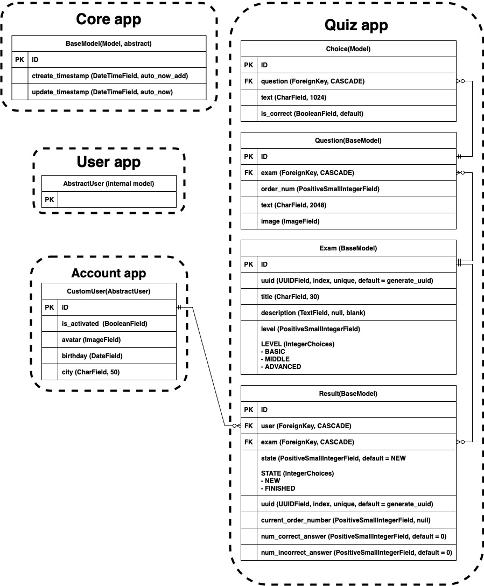

# Django QUIZ

## Технические требования  
### Web-UI
  1. Регистрация
      - [x] регистрация (с подтверждением по email)
      - [x] авторизация
      - [x] смена пароля
      - [x] сброс пароля
    
  2. Возможности пользователя
      - прохождение любого теста
      - последовательно проходить вопросы теста (один за другим)
      - завершение отложенного теста
      - удаление незавершенного теста 
      - просмотр результатов
    
  3. После завершения теста
      - отчет о ко-ве правильных и неправильных ответов
      - процент правильных ответов

### Admin site
  1. Управление пользователями
  2. Управление тестами
      - [x] добавление теста
      - [x] изменить тест
      - [x] удаление теста
      - валидация теста
        - [x] нельзя сохранить вопрос:
            - [x] без указания правильного ответа
            - [x] в которых все ответы правильные
        - нельзя сохранить тест если:
            - некорректный order_num (должен быть от 1 до 100 и увеличиваться на 1)
            - максимальное значение order_num не более максимально допустимого кол-ва вопросов
            - [x] кол-во вопросов менее 3 или более 100

### Дополнительные требования
1. [x] Проект должен быть на Git-е
2. [x] Наличие файла requirements.txt
3. [x] venv
4. [ ] PostgreSQL
5. [ ] Наличие дампа данных
6. [x] bootstrap
7. [ ] API + Tests
8. [ ] Docker image
9. [ ] Кэширование 
10. [ ] Планировщик
11. [ ] Деплой на Amazon

## DB - Schema



## Lesson 01
- Создаём GIT репозиторий, клонируем его
- В клонированном репо создаём проект
- Устанавливаем Django и все необходимые зависимости
- Создаём приложения:
  - **accounts**
  - **quiz**
- Настраиваем проект
- Переопределяем модель **User**
- Создаём формы регистрации и редактирования пользователя
- Создаём view регистрации, активации и успешной активации
- Для отправки письма с приглашением активировать аккаунт, используем созданный сигнал
- Сообщаем Django о новой модели пользователя

## Lesson 02
- Добавили 
  - шаблоны для приложения **Accounts**
  - базовый (**base.html**) и индексный (**index.html**) шаблоны
  - навигационную панель (**nav_bat.html**)
  - модель **CustomUser** в админку
- Добавили **Login**, **Logout**, **Profile**, **UpdateProfile**
- Создали маршрутизатор приложения Accounts и добавили его в главный маршрутизатор
- Для обработки статических и медиа файлов в главный маршрутизатор добавили настройку
    ```python
    if settings.DEBUG:
        urlpatterns += static(settings.MEDIA_URL, document_root=settings.MEDIA_ROOT)
        urlpatterns += static(settings.STATIC_URL, document_root=settings.STATIC_ROOT)
    ```
- Определили модели приложения **Quiz**
  - **BaseModel**
  - **Exam**
  - **Question**
  - **Choice**
  - **Result**
- Создали **FormSet**'s для обработки инлайн таблиц моделей **Question** и **Choice** в админке
- Добавили модели **Exam**, **Question**, **Choice** и **Result**  админку
- Создали валидаторы вопросов и один валидатор тестов
